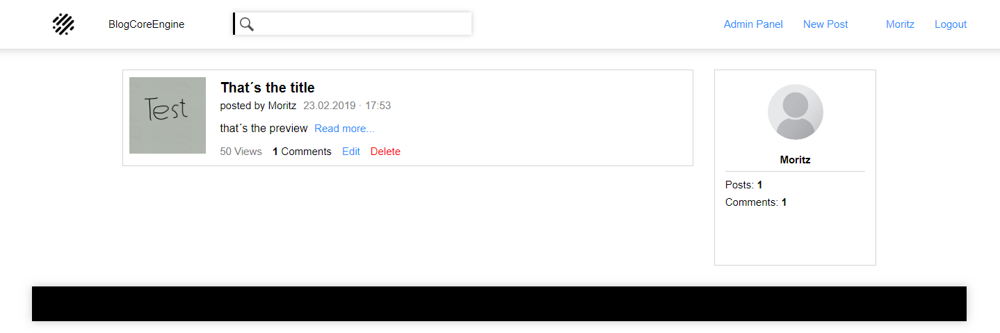
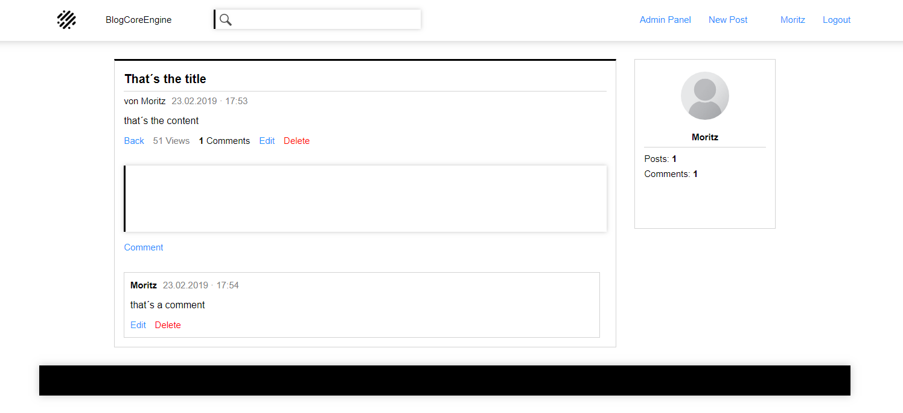
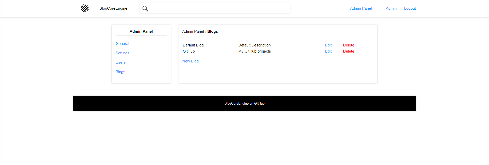
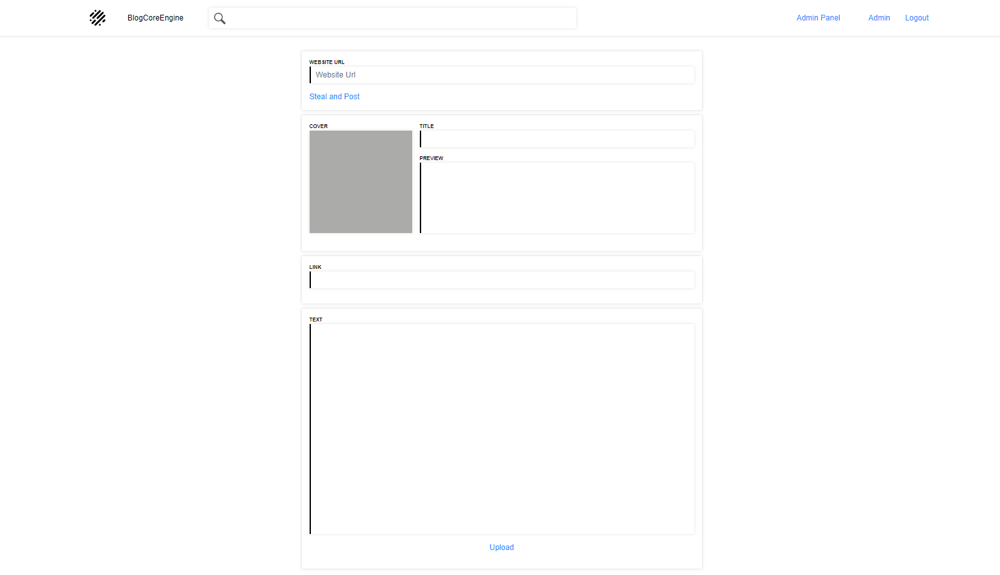
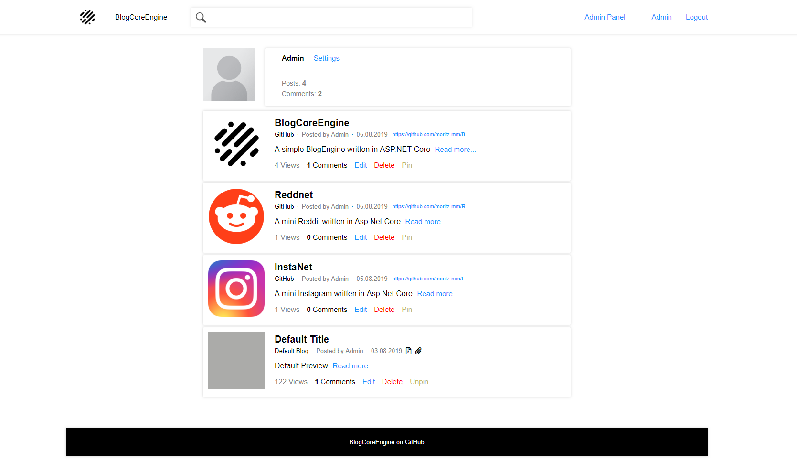

# BlogCoreEngine
A simple open source BlogEngine written in Asp.NET Core

# Setup to run it on you Computer
You need the .NET Core 2.2 SDK (Download: https://dotnet.microsoft.com/download) and the Microsoft Sql Server (Download: https://www.microsoft.com/en-au/sql-server/sql-server-downloads *Free Developer Version)

# Important
- Make your own Account

- Login into the Admin Account
  - UserName: Admin
  - Password: adminPassword

- Go into the Admin Panel > Users

- Give your Account Admin

- LogOut! then Login with your Account

- Go with your Account in the Admin Panel and delete the default Admin Account!

# Features
- Login/Register System
- User Comments
- View System
- Admin Panel
  - Change Blog Name
  - Change Blog Logo
  
# Images

   Index
  
  
  

  
  Details
  
  
  

  
  New Post 
  
  
  

  
  Profil
  
  
  

  
  Admin Panel Settings
  
  
  

  
  Admin Panel Users
  

